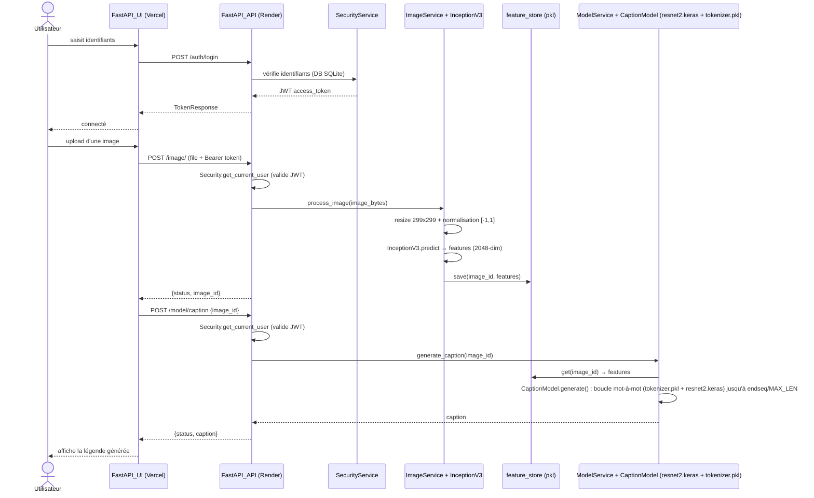

# Diagramme de séquence — route principale

Flux : login → upload image → génération de légende, tel qu'observé sur les routes `/auth/login`, `/image/`, `/model/caption`.

```mermaid
sequenceDiagram
    actor User as Utilisateur
    participant UI as FastAPI_UI (Vercel)
    participant API as FastAPI_API (Render)
    participant Sec as SecurityService
    participant Img as ImageService + InceptionV3
    participant Store as feature_store (pkl)
    participant Model as ModelService + CaptionModel (resnet2.keras + tokenizer.pkl)

    User->>UI: saisit identifiants
    UI->>API: POST /auth/login
    API->>Sec: vérifie identifiants (DB SQLite)
    Sec-->>API: JWT access_token
    API-->>UI: TokenResponse
    UI-->>User: connecté

    User->>UI: upload d'une image
    UI->>API: POST /image/ (file + Bearer token)
    API->>API: Security.get_current_user (valide JWT)
    API->>Img: process_image(image_bytes)
    Img->>Img: resize 299x299 + normalisation [-1,1]
    Img->>Img: InceptionV3.predict → features (2048-dim)
    Img->>Store: save(image_id, features)
    API-->>UI: {status, image_id}

    UI->>API: POST /model/caption {image_id}
    API->>API: Security.get_current_user (valide JWT)
    API->>Model: generate_caption(image_id)
    Model->>Store: get(image_id) → features
    Model->>Model: CaptionModel.generate() : boucle mot-à-mot (tokenizer.pkl + resnet2.keras) jusqu'à endseq/MAX_LEN
    Model-->>API: caption
    API-->>UI: {status, caption}
    UI-->>User: affiche la légende générée
```
